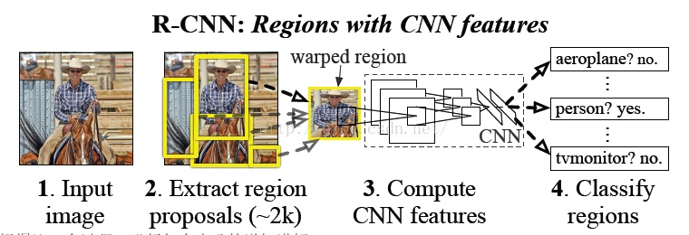
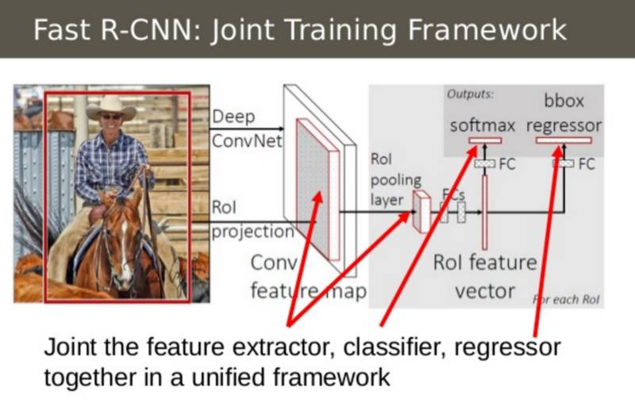
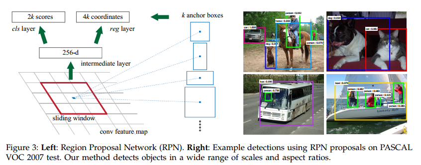
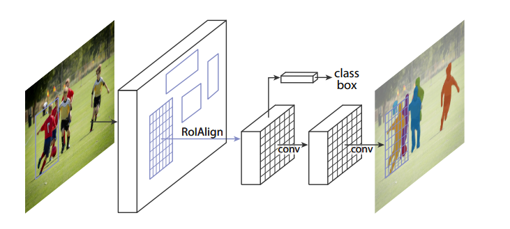
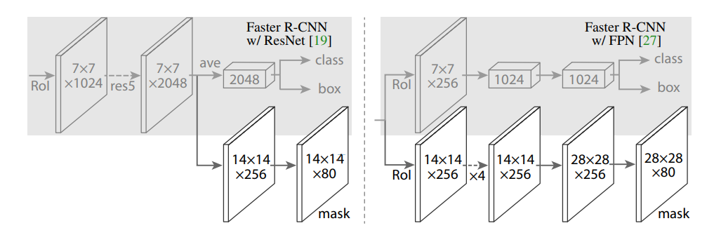

# RCNN series
In order to understand the Mask R-CNN that can achieve pixel-level segmentation,we analyze R-CNN, Fast R-CNN, and Faster R-CNN in turn.
## R-CNN
       
RCNN algorithm is divided into 4 steps:   
&ensp;&ensp;1. Candidate region generation: 1K~2K candidate regions for one image(Selective Search)   
&ensp;&ensp;2. Feature extraction: extract features using a deep convolutional network for each candidate region   
&ensp;&ensp;3. Category judgment: the feature is sent to each class of SVM classifier to determine whether it belongs to this class   
&ensp;&ensp;4. Position refinement: Finely correct candidate frame position using a regression
## Fast R-CNN
  
- Fast R-CNN combines feature extractors, SVM classifiers, and regressions, all using CNN.      
- Fast R-CNN extracts the feature from the whole image and then selects features based on the location of the candidate region in the original image. In order to solve the problem of different number of features, the Fast-RCNN joins the ROI layer so that the number of features is the same after passing through the ROI layer(Variant of Spatial Pyramid Pooling).     
## Faster R-CNN

Faster-RCNN introduced the RPN(region proposal network) instead of selective-search, which achieved end-to-end.Faster-RCNN puts the RPN behind the last convolutional layer.          
**RPF**   
    
Slide a window on the feature map, at each window position, the network outputs a score and a bounding box at each anchor point (when the number of anchors is k, there will be 4k frame coordinates). The position of the sliding window provides general position information of the object, and the regression of the frame position provides a more precise position of the frame.
## Mask R-CNN 

Mask R-CNN extends R-CNN to pixel-level segmentation. Mask R-CNN replaces the Roi Pooling layer with RoiAlign and adds a parallel FCN layer (mask layer).      
Input an preprocessed image and extract features using CNN,       
**RoiAlign**    

啊！
